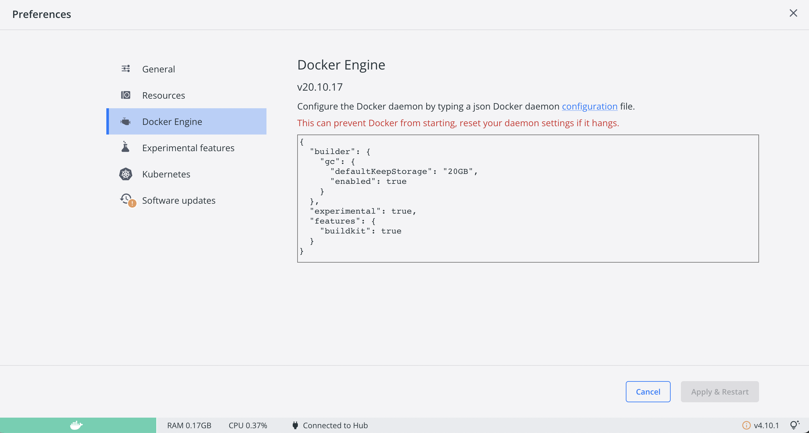

<h1 align="center">Docker</h1>

[privileges]: https://docs.docker.com/engine/reference/run/#runtime-privilege-and-linux-capabilities
[overlayfs]: https://wiki.archlinux.org/index.php/Overlay_filesystem

## Table of Contents
- [Table of Contents](#table-of-contents)
- [Prerequisites](#prerequisites)
- [Run Docker Containers with Docker Hub Images](#run-docker-containers-with-docker-hub-images)
- [Docker configurations](#docker-configurations)
- [Port configurations](#port-configurations)
- [Docker \& Subdirectories](#docker--subdirectories)
- [Image Building](#image-building)
  - [Prerequisites for Buildx](#prerequisites-for-buildx)
- [Shell Scripts](#shell-scripts)
- [Aliases](#aliases)
    - [Temporary Aliases](#temporary-aliases)
    - [Permanent Aliases](#permanent-aliases)


## Prerequisites
* Install Docker
  * [Linux](https://docs.docker.com/desktop/install/linux-install/)
  * [Mac](https://docs.docker.com/desktop/install/mac-install/)
  * [Windows](https://docs.docker.com/desktop/install/windows-install/)

It is recommended to nstall [Docker Desktop](https://www.docker.com/products/docker-desktop/) as well, a more intuitive GUI for Docker.

Verify Docker is installed in your Terminal: ```docker info```

## Run Docker Containers with Docker Hub Images

Launch *Blast Radius* for a local directory by manually running:

> sh, zsh, bash
```sh
docker run --rm -it -p 5000:5000 \
  -v $(pwd):/data:ro \
  --security-opt apparmor:unconfined \
  --cap-add=SYS_ADMIN \
  ianyliu/blast-radius-fork
```

Note: If you have spaces in your directory then you may have to change `-v ${pwd}:/data:ro` to `-v "${pwd}:/data:ro"` instead.

> Windows PowerShell
```powershell
docker run --rm -it -p 5000:5000 `
  -v ${pwd}:/data:ro `
  --security-opt apparmor:unconfined `
  --cap-add=SYS_ADMIN `
  ianyliu/blast-radius-fork
```

If you do not have the Docker image, it will be automatically pulled for you. You can also build the image yourself
see ([Image Building](#image-building)).

A slightly more customized variant of this is also available as an example
[docker-compose.yml](./Docker/docker-compose.yml) use case for Workspaces.

## Docker configurations

<details><summary></summary>

*Terraform* module links are saved as _absolute_ paths in relative to the
project root (note `.terraform/modules/<uuid>`). Given these paths will vary
betwen Docker and the host, we mount the volume as read-only, assuring we don't
ever interfere with your real environment.

However, in order for *Blast Radius* to actually work with *Terraform*, it needs
to be initialized. To accomplish this, the container creates an [overlayfs][]
that exists within the container, overlaying your own, so that it can operate
independently. To do this, certain runtime privileges are required --
specifically `--cap-add=SYS_ADMIN`. 

> Note: This is considered a security risk by some, so be sure you understand how this works. 

For more information on how this works and what it means for your host, check
out the [runtime privileges][privileges] documentation.
</details>

## Port configurations 

<details><summary></summary>
To run the Docker image on a different port, you can modify the Docker command so that PORTNUMBER 
maps to the desired port number. 

```sh
docker run --rm -it -p PORTNUMBER:5000 \
  -v $(pwd):/data:ro \
  --security-opt apparmor:unconfined \
  --cap-add=SYS_ADMIN \
  ianyliu/blast-radius-fork
```

</details>

## Docker & Subdirectories

<details>
<summary></summary>

If you organized your *Terraform* project using stacks and modules,
*Blast Radius* must be called from the project root and reference them as
subdirectories -- don't forget to prefix `--serve`!

For example, let's create a Terraform `project` with the following:

```txt
$ tree -d
`-- project/
    |-- modules/
    |   |-- foo
    |   |-- bar
    |   `-- dead
    `-- stacks/
        `-- beef/
             `-- .terraform
```

It consists of 3 modules `foo`, `bar` and `dead`, followed by one `beef` stack.
To apply *Blast Radius* to the `beef` stack, you would want to run the container
with the following:

```sh
$ cd project
$ docker run --rm -it -p 5000:5000 \
    -v $(pwd):/data:ro \
    --security-opt apparmor:unconfined \
    --cap-add=SYS_ADMIN \
    ianyliu/blast-radius-fork --serve stacks/beef
```
</details>

## Image Building

If you'd like to build your own Docker image after making changes to Blast Radius, you can build it in 2 ways:
1. Normal Build

To execute a normal build, navigate (using commands like `cd`) to the root of your modified Blast Radius project in your terminal. 
Make sure you have the Dockerfile in the root of your project.
Now run:

```
docker build -t imagename .
``` 

Replace imagename with the name you'd like to give your image. 

Once the build is complete you can run it in the Terraform directory you'd like visualize.

> sh, zsh, bash
```sh
docker run --rm -it -p 5000:5000 \
  -v $(pwd):/data:ro \
  --security-opt apparmor:unconfined \
  --cap-add=SYS_ADMIN \
  imagename
```

> Windows PowerShell
```powershell
docker run --rm -it -p 5000:5000 `
  -v ${pwd}:/data:ro `
  --security-opt apparmor:unconfined `
  --cap-add=SYS_ADMIN `
  imagename
```

Go to http://127.0.0.1:5000/ to view the visualization.

2. Multi-CPU Build

To build Docker images with multi-architecture support, we will use something known as docker 
[buildx](https://docs.docker.com/build/buildx/). 

### Prerequisites for Buildx 

There are 2 ways to set up buildx, the first being insanely easy, while the second being quite complicated. 

1. **Install Docker Desktop>=2.1.0**  
Install Docker Desktop [here](https://www.docker.com/products/docker-desktop/).
  Then go to `Settings > Docker Engine`. Edit the JSON configuration and change it so that "buildkit" is set to "true". 
    
2. **Manual Installation**  
You will need the following software requirements:   
- Docker >= 19.03
- Experimental mode enabled for Docker CLI 
  - Set an environment variable: `export DOCKER_CLI_EXPERIMENTAL=enabled`
  - Edit config file at `$HOME/.docker/config.json`: `{"experimental": "enabled"}`
- Linux kernel >= 4.8 or fix-binary (F) flag support on the kernel side of binfmt_misc
- binfmt_misc file system mounted 
- Host or Docker image based installation of:
  - Host installation 
    - QEMU installation 
    - binfmt-support package >= 2.1.7 
  - Docker image-based installation 
    - A Docker image containing both QEMU binaries and set up scripts that register QEMU in binfmt_misc

For more details on manual installation see 
[this Medium article](https://medium.com/@artur.klauser/building-multi-architecture-docker-images-with-buildx-27d80f7e2408).

Check that buildx is installed: `docker buildx`

Now we need to create a buildx builder 

`docker buildx create --name mybuilder`

and use the builder

`docker buildx use mybuilder`

View your new builder: `docker buildx ls`

As of 2022, buildx can export the image locally or to a Docker registry. 

However, local image loading is only supported for single-architecture images. 
To use multi-architecture images, we will need to push to a Docker registry. 

To use a Docker registry, we need to first login using 
`docker login`.
If you don't have a Docker account yet, you can create one
[here](https://hub.docker.com/). 

Navigate to the directory where the `Dockerfile` is located (download the repo via Git/GitHub if you haven't already).
Now we can build the image. 

```sh
docker buildx build \ 
--platform  \  
linux/arm64,linux/amd64,linux/amd64/v2,linux/ppc64le,linux/s390x,linux/386,linux/arm/v7,linux/arm/v6 \ 
-t imagename \  
--push . 
```

Run the image (replace USERNAME and imagename accordingly)
```sh
docker run --rm -it -p 5000:5000 \
  -v $(pwd):/data:ro \
  --security-opt apparmor:unconfined \
  --cap-add=SYS_ADMIN \
  USERNAME/imagename
```

> Note: Architectures `linux/riscv64,linux/mips64le,linux/mips64` are supported by buildx, 
but the image of Python Alpine does not usually support these architectures.
> Note: If in the future local loading of Docker images is supported, replace `--push` with `--load`


## Shell Scripts 
In the [PowerShell folder](PowerShell) and [BASH folder](BASH) there are Docker build and run shell scripts.
Using shell scripts makes running and building the Docker containers easier and less error prone. 

Here's an example of running the docker Shell script for running a container. 

```sh
cd blast-radius-fork 
/bin/bash ./docker_run.sh
```

Compare that to

```sh
docker run --rm -it -p 5000:5000 \
  -v $(pwd):/data:ro \
  --security-opt apparmor:unconfined \
  --cap-add=SYS_ADMIN \
  blast-radius-fork
```

## Aliases

An alias in Linux is a shortcut to a command. They are usually used to replace long commands.
To see what aliases you have, run `alias`. 

There are 2 types of aliases. Temporary ones and permanent ones. 

#### Temporary Aliases

To creat temporary aliases, simply follow the formula of ```alias SHORTCUT='COMMAND'```. Here's an example of a clear 
command referenced by `c`: `alias c='clear'`

Let's say we want to use `br-docker` to replace the long Docker run command.

```sh
alias br-docker='docker run --rm -it -p 5000:5000 \
-v $(pwd):/data:ro \
  --security-opt apparmor:unconfined \
  --cap-add=SYS_ADMIN \
  ianyliu/blast-radius-fork'
```
Now we can just run `br-docker` whenever we want to run a Docker container to start Blast Radius!

Here's another example using [Shell scripts](#shell-scripts). 
```sh
alias br-build='/bin/bash /Users/USERNAME/blast-radius-fork/BASH/docker_build.sh'
```
Now we can build our Docker image by just using `br-build`!

#### Permanent Aliases

To create permanent aliases, one needs to add it to their shell configuration file. 

* PowerShell configuration files are usually located in `$PSHOME`
* BASH: `~/.bashrc`
* ZSH: `~/.zshrc`
* FISH: `~/.config/fish/config.fish`

Now open the shell config file in a text editor. 
Example: `sudo vi ~/.bashrc`

Go to the aliases section, and add your aliases. 
Here's a helpful 
[article](https://phoenixnap.com/kb/linux-alias-command#:~:text=In%20Linux%2C%20an%20alias%20is,and%20avoiding%20potential%20spelling%20errors.).