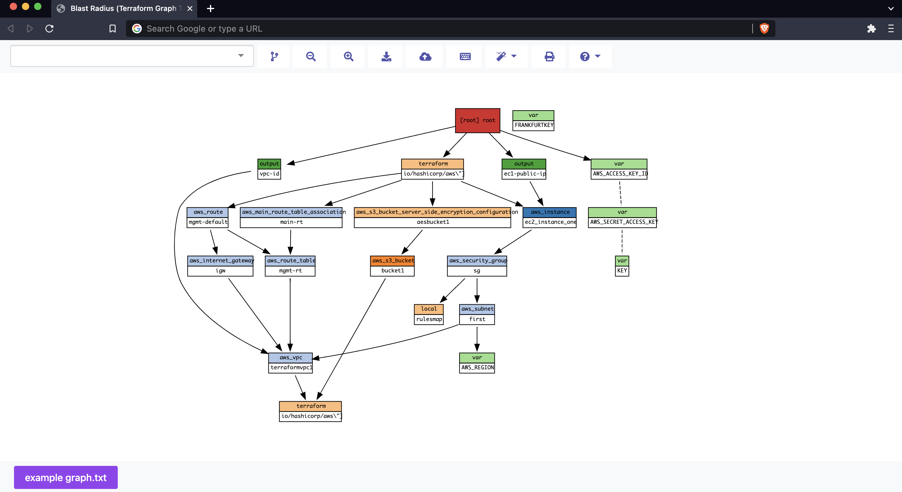

<h1 align="center">Blast Radius</h1>

[terraform]: https://www.terraform.io/
[examples]: https://28mm.github.io/blast-radius-docs/
[docs]: https://28mm.github.io/blast-radius-docs/

_Blast Radius Fork_ is an interactive visualizer for [Terraform](https://www.terraform.io/) based off of 
[_Blast Radius_](https://28mm.github.io/blast-radius/), 
which hasn't been actively maintained since 2020. 

It is a work in progress and is not guaranteed to be bug free. Please feel free to contribute!

----------------------------------

## Table of Contents 
- [Table of Contents](#table-of-contents)
- [Usage](#usage)
- [Prerequisites for Local Use](#prerequisites-for-local-use)
- [Local Quickstart](#local-quickstart)
- [Docker Quickstart](#docker-quickstart)
- [Kubernetes Quickstart](#kubernetes-quickstart)
  - [Kubernetes Prerequisites](#kubernetes-prerequisites)
  - [Start the App on Kubernetes](#start-the-app-on-kubernetes)
  - [Kubernetes Debugging/Helpful Commands](#kubernetes-debugginghelpful-commands)
- [Parameters](#parameters)
- [Embedded Figures](#embedded-figures)
- [How It Works](#how-it-works)
- [Motivation](#motivation)
- [What's Different](#whats-different)
- [Future Implementations \& Possible Functionalities](#future-implementations--possible-functionalities)
- [Further Reading](#further-reading)
- [Other Tools to Check Out](#other-tools-to-check-out)

----------------------------------

## Usage

Use _Blast Radius_ to:

* __Learn__ about *Terraform* or one of its providers through real [examples][]
* __Visualize__ your infrastructure
* __Reason__ about relationships between resources and evaluate changes to them
* __Interact__ with the diagram below (and many others) [in the docs][examples]
* __Compare__ different infrastructure 



## Prerequisites for Local Use

* [Python](https://www.python.org/) 3.7+
* [Graphviz](https://www.graphviz.org/)
* [Terraform](https://www.terraform.io/) (if you do not have generated Terraform DOT graphs yet)

> __Note:__ For macOS you can `brew install graphviz`
 
> __Note:__ For Docker usage prerequisites, see [Docker.md](Docker.md)

## Local Quickstart

The fastest way to run with *Blast Radius* is to install it with
`pip` to your pre-existing environment:

```sh
python -m pip install git+https://github.com/Ianyliu/blast-radius-fork
```
or 
```sh
python3 -m pip install git+https://github.com/Ianyliu/blast-radius-fork
```

You can then run Blast Radius from the command line:

```sh
blast-radius --serve 
```

If you want to create graphs for an initialized *Terraform* directory, you can just start *Blast Radius* within the 
initialized *Terraform*
directory:

```
blast-radius --serve /path/to/terraform/directory
```

And you will shortly be rewarded with a browser link http://127.0.0.1:5000/.

[//]: # (You can specify the port number with the `--port` flag:)

[//]: # ()
[//]: # (```)

[//]: # (blast-radius --serve /path/to/terraform/directory --port=8080)

[//]: # (```)


Note: If you do not have an initialized Terraform directory but have the DOT script (the output of the `terraform graph` command, note that this is not the same as a JSON file or state graph). You can either copy and paste the DOT script into the text input field or uploaded the DOT script file.

Other ways to run it include [Docker](#docker-quickstart) and [Kubernetes](#kubernetes-quickstart)

## Docker Quickstart

[privileges]: https://docs.docker.com/engine/reference/run/#runtime-privilege-and-linux-capabilities
[overlayfs]: https://wiki.archlinux.org/index.php/Overlay_filesystem

Launch a container for a local directory with *Blast Radius* running:

sh, zsh, bash, etc. (Linux recommended):
```sh
docker run --rm -it -p 5000:5000 \
  -v $(pwd):/data:ro \
  --security-opt apparmor:unconfined \
  --cap-add=SYS_ADMIN \
  ianyliu/blast-radius-fork
```

Windows PowerShell:
```powershell
docker run --rm -it -p 5000:5000 `
  -v ${pwd}:/data:ro `
  --security-opt apparmor:unconfined `
  --cap-add=SYS_ADMIN `
  ianyliu/blast-radius-fork
```

Note: If you have spaces in your directory then you may have to change `-v ${pwd}:/data:ro` to `-v "${pwd}:/data:ro"` instead.

A slightly more customized variant of this is also available as an example
[docker-compose.yml](./Docker/docker-compose.yml) usecase for Workspaces.

For more details on Docker usage, see [Docker.md](Docker.md)

## Kubernetes Quickstart

Launch *Kubernetes* locally using Minikube, Kubernetes, and Kubectl:

### Kubernetes Prerequisites
<details>
<summary></summary>

* Docker (or another container or virtual machine manager) 
* Kubectl: https://kubernetes.io/docs/tasks/tools/
* Minikube: https://minikube.sigs.k8s.io/docs/start/
</details>

### Start the App on Kubernetes
<details>
<summary></summary>

1. Start Minikube  
```minikube start```
2. Change directories to the file containing the 2 YAML files (*k8-blast-radius-deployment.yaml* and 
3. *k8-blast-radius-service.yaml* apply the YAML configuration files to the default namespace (or any other namespace)  
```
kubectl apply -f k8-blast-radius-deployment.yaml
kubectl apply -f k8-blast-radius-service.yaml
```
Access the app  
```
minikube service  k8-blast-radius-service
```
</details>

### Kubernetes Debugging/Helpful Commands
<details>
<summary></summary>

* To check the state of your pods (containers), execute the following:  
```kubectl get pods```  
* To see more details about a pod. (Replace ```<namespace>``` and ```<pod>``` with the corresponding values)  
```kubectl describe -n=<namespace> pod/<pod>```
* To see logs for a pod (replace corresponding values)  
```kubectl logs -f -n=<ns> <pod>```
* The most helpful tool is probably Minikube's dashboard, where you can more things  
```minikube dashboard```
</details>

## Parameters 
* Directory: Defaults to `$PWD` or current directory. The directory in which to look for Terraform files. 
This is required if the user wants to use a Terraform project as input 
(instead of uploading a file or pasting DOT script). 
* `--port`: Defaults to 5000. The port to access the app (http://localhost:PORT) 
Any valid localhost port is allowed.
* `--serve`: Starts a webserver locally with Terraform's interactive graph
* `--json`: Prints a JSON representation of a Terraform graph. The JSON has 2 items, `edges` and `nodes`. 
* `--dot`: Returns a string consisting of Graphviz DOT script of graph. (no colors)
* `--svg`: Prints SVG representation of graph (with colors).
* `--graph`: 
* `--module-depth`: Takes an integer as input and only eliminates display of deeply nested modules. 
This will not show every node on the graph unless the user specifies a depth larger than the graph.
*  `--focus`: Show only specified resource and its dependencies. Not available in web app. Only works with `--json` and `--svg`.
  * Example: ```terraform graph | blast-radius --focus \
    "[root] module.us-west-2.module.secondary_subnet.data.aws_vpc.target" --svg```
* `--center`: Prunes the graph to a subgraph (same thing as red button in web app). Only works with `--json` and `--svg`.
  * Example: ```terraform graph | blast-radius --center \
    "[root] module.us-west-2.module.secondary_subnet.data.aws_vpc.target" --svg``` 

## Embedded Figures

You may wish to embed figures produced with *Blast Radius* in other documents.
You will need the following:

1. An `svg` file and `json` document representing the graph and its layout.
2. `javascript` and `css` found in `.../blastradius/server/static`
3. A uniquely identified DOM element, where the `<svg>` should appear.

You can read more details in the [documentation for embedded figures](doc/embedded.md).

## How It Works

*Blast Radius* uses 
- [Graphviz](https://graphviz.org/) package to layout graph diagrams
- [python-hcl2](https://github.com/amplify-education/python-hcl2) to parse [Terraform][] configuration
- [d3.js](https://d3js.org/) to implement interactive features
- [Flask](https://flask.palletsprojects.com/) to start a server
- [Vanilla JavaScript](http://vanilla-js.com/) and [jQuery](https://jquery.com/) for front-end functionality
- [HTML](https://html.com/), [CSS](https://developer.mozilla.org/en-US/docs/Web/CSS), 
- [Bootstrap](https://getbootstrap.com/), and other libraries for front-end design

Terraform generates graphs in the form of [DOT](https://en.wikipedia.org/wiki/DOT_language) language. *Blast Radius* 
uses [Graphviz](https://graphviz.org/) to layout the graph after converting to SVG, 
and D3.js to implement interactive features. 
Terraform configurations are then parsed by [python-hcl2](https://github.com/amplify-education/python-hcl2) to generate 
a [JSON](https://en.wikipedia.org/wiki/JSON_document) representation of the graph, 
which provides details of each resource on hover.
All of this is hosted on [Flask](https://flask.palletsprojects.com/) and runs on a [local server](http://localhost:5000/). 

## Motivation
The original creator of this open source project, [Patrick McMurchie](https://github.com/28mm), has been inactive on 
this project for some time. 
There are many issues waiting to be resolved, and features to be added. This repository presents some 
**basic modifications**, **additional features**, and **enhanced accessibility**.  

## What's Different
* **Independence** from Terraform and Terraform files
  * App can run on its own, accepting DOT file or keyboard input 
* Multi-graph feature
  * The app can **display multiple graphs** and can be compared side by side with tabs 
* Print 
  * The graph can be printed, although the print can sometimes cut off the graph at times
* UI changes
  * To enable a better design, the multi-colored buttons and other parts of the page have been changed to follow the 60-30-10 design rule
* Compatability with recent versions of Terraform, Python, and Python packages
* Created a new Docker image at [ianyliu/blast-radius-fork](https://hub.docker.com/repository/docker/ianyliu/blast-radius-fork/) for multi-cpu architectures equipped with updated features
* Added Shell scripts that can be used to run & build the Docker image with aliases for convenience 
* Updated README.md 
* Integrated changes across other forks and pull requests of Blast Radius, including: 
  * PowerShell scripts for running and building Docker containers
  * Running Terratests during Docker build
  * Allowing Blast Radius to run even if JSON data couldn't be parsed  

## Future Implementations & Possible Functionalities
* Accept file input as a command-line argument 
  * (```Ex. blast-radius --serve --graphfile ./graphraw.txt```)
* Allow downloading of other file formats such as .json, .png, .jpg, .zip with entire static assets 
* Hovering over tabs display number of resources or perhaps a snapshot of the graph
* Allow upload of multiple files and folders
* Drag and drop file upload 
* Dark mode 
* Support for Terragrunt 
* Support for Tfenv 
* Compress Docker image size (currently 180+MB)
* Editable tab names
* Reorder tabs via drag
* Responsive webpage
* Add filter by color option for graphs 
* Graph sharing
  * Generate unique URL to allow users to view graphs created by others
* Create standalone executable (run without CLI)
  * Docker2exe
  * PyInstaller 
* Mobile interface formatting
* Loading spinner before graphs load (and disable buttons)
* Cache DOT script or SVG in local storage so it can be loaded next time without re-upload
* Animation
  * Shows difference between current state and state after apply
  * Shows difference between one Terraform graph and another via animation 
* Add example Terraform DOT files that allow Blast Radius to be run on Microsoft Azure, Google Cloud, IBM Cloud Services, etc.
* Integration with Neo4j or other graph database, parse *Terraform* files and find relationships between resources


## Further Reading

The original development of *Blast Radius* is documented in a series of
[blog](https://28mm.github.io) posts by the original creator:

* [part 1](https://28mm.github.io/notes/d3-terraform-graphs): motivations, d3 force-directed layouts vs. vanilla graphviz.
* [part 2](https://28mm.github.io/notes/d3-terraform-graphs-2): d3-enhanced graphviz layouts, meaningful coloration, animations.
* [part 3](https://28mm.github.io/notes/terraform-graphs-3): limiting horizontal sprawl, supporting modules.
* [part 4](https://28mm.github.io/notes/d3-terraform-graphs-4): search, pan/zoom, prune-to-selection, docker.

A catalog of example *Terraform* configurations, and their dependency graphs
can be found [here](https://28mm.github.io/blast-radius-docs/).

* [AWS two-tier architecture](https://28mm.github.io/blast-radius-docs/examples/terraform-provider-aws/two-tier/)
* [AWS networking (featuring modules)](https://28mm.github.io/blast-radius-docs/examples/terraform-provider-aws/networking/)
* [Google two-tier architecture](https://28mm.github.io/blast-radius-docs/examples/terraform-provider-google/two-tier/)
* [Azure load-balancing with 2 vms](https://28mm.github.io/blast-radius-docs/examples/terraform-provider-azurem/2-vms-loadbalancer-lbrules/)

These examples are drawn primarily from the `examples/` directory distributed
with various *Terraform* providers, and aren't necessarily ideal. Additional
examples, particularly demonstrations of best-practices, or of multi-cloud
configurations strongly desired.

There are more 188 forks as of August 2022, each containing new updates or features of some sort. Notable ones include: 
- https://github.com/gruberdev/blast-radius/
- https://github.com/IBM-Cloud/blast-radius/
- https://github.com/nishubharti/blast-radius/ 
- https://github.com/obourdon/blast-radius/
- https://github.com/nibhart1/blast-radius/

An alternate working Docker image for Blast Radius is https://hub.docker.com/r/grubertech/blast-radius


It would greatly help if you could contribute to bringing all of these forks into one repository so that we can have a tool that can be used by everyone.

## Other Tools to Check Out

[Inframap]: https://github.com/cycloidio/inframap
[Terraform Graph Beautifier]: https://github.com/pcasteran/terraform-graph-beautifier
[Terraform Visual]: https://github.com/hieven/terraform-visual
[Rover]: https://github.com/im2nguyen/rover
[Pluralith]: https://www.pluralith.com/
* [Pluralith]
  * "_A tool for Terraform state visualisation and automated generation of infrastructure documentation_"
  * Written in: Golang
  * Pros
    * Change Highlighting
    * Apply plan within application
    * Cost information
    * Provides granular details on click
    * Plan-to-plan comparison (tabs)
    * Filter (by Created, Destroyed, Updated, Recreated)
    * GUI (Graphical User Interface)
    * Lots more features... there's so many!
  * Cons
    * More advanced features cost money (understandably)
    * Newer, with less tutorials and tests
* [Inframap]
    * "_Read your tfstate or HCL to generate a graph specific for each provider, showing only the resources that are most important/relevant._"
    * Input: tfstate or HCL
    * Written in: Golang
    * Pros: 
      * Works directly with Terraform state files or .tf files, instead of DOT input
      * Docker
      * Simplifies graph
    * Cons:
      * Cannot provide more detail, oversimplification
* [Terraform Graph Beautifier]
  * "_Terraform graph beautifier_"
  * Input: DOT script output from ```terraform graph``` command in Terraform init directory
  * Written in: Golang
  * Pros
    * Outputs to: HTML page, JSON document, cleaner version of Graphviz DOT script
  * Cons 
    * Requires Terraform init directory and Terraform installation
* [Terraform Visual]
  * "_Terraform Visual is an interactive way of visualizing your Terraform plan_"
  * Input: Terraform JSON plan files
  * Written in: TypeScript, JavaScript, CSS
  * Pros
    * Docker compatible
    * Creates HTML page that you can save later
    * Has online version: https://hieven.github.io/terraform-visual/  (so doesn't require local installation)
* [Rover]
  * "_Interactive Terraform visualization. State and configuration explorer._"
  * Inputs: Terraform files in a directory or provided plan file
  * Written in: Golang, VueJS
  * Pros
    * Very granular view and control of resources 
    * Shareable via .svg, .html, .json 
    * Standalone mode generates .zip file containing all static assets 
    * Docker compatible
  * Cons
    * Requires Terraform directory to be init, or else it will not work (even in Docker it also needs init)
