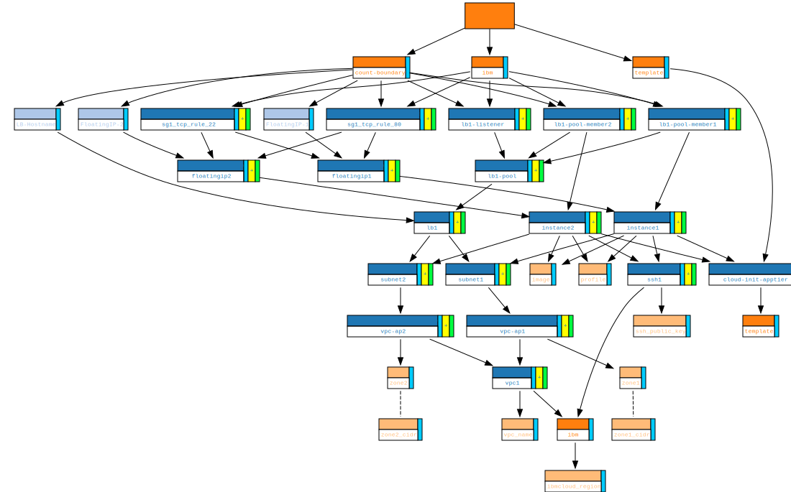

# Blast Radius

*Blast Radius* is a tool for reasoning about *Terraform* dependency graphs with interactive visualizations. Use *Blast Radius* to:
  * **Learn** about *Terraform* or one of its cloud providers, through [example configurations](https://blast-radius.github.io).
  * **Document** your infrastructure
  * **Reason** about relationships between resources, and evaluate changes to them.



  * **Interact** with this diagram (and many others) [here](https://blast-radius.github.io).

# Quickstart

Install *Blast Radius* with pip, and *Graphviz* through your system's package manager.

````bash
[...]$ pip3 install blast-radius
[...]$ brew install graphviz
````

Point *Blast Radius* at an `init-ed` *Terraform* project, and connect with your browser.

````bash
[...]$ blast-radius --serve /path/to/terraform-project
 * Running on http://127.0.0.1:5000/ (Press CTRL+C to quit)
````

# Implementation Details

*Blast Radius* uses the [*Graphviz*](http://graphviz.org/) package to layout graph diagrams, [*PyHCL*](https://github.com/virtuald/pyhcl) to parse [*Terraform*](https://www.terraform.io/) configurations, and [*d3.js*](https://d3js.org/) to implement interactive features and animations.

# Further Reading

  * The motivations for *Blast Radius* are documented in a series of [blog](https://28mm.github.io) posts: [part 1](https://28mm.github.io/notes/d3-terraform-graphs), and [part 2](https://28mm.github.io/notes/d3-terraform-graphs-2).
  * A catalog of example *Terraform* configurations, and their dependency graphs can be found at [https://blast-radius.github.io/](https://blast-radius.github.io).
