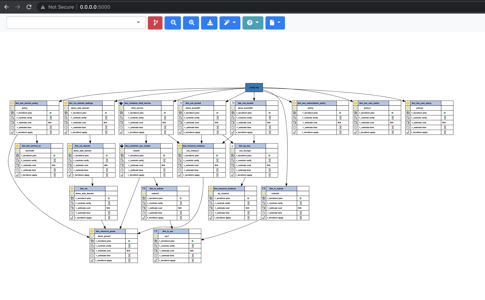
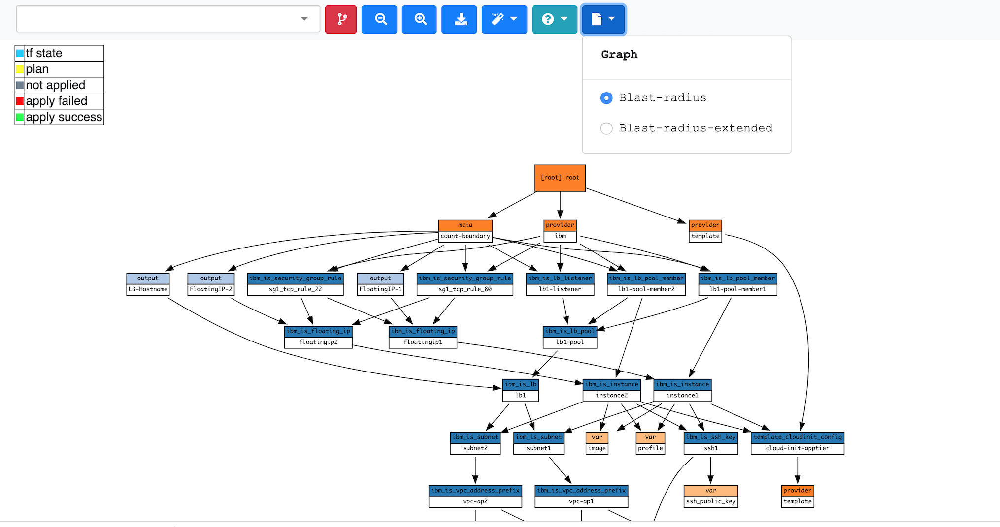
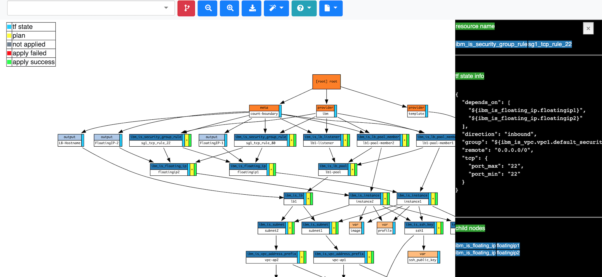

# Blast Radius

[](https://badge.fury.io/py/BlastRadius)

[terraform]: https://www.terraform.io/
[examples]: https://28mm.github.io/blast-radius-docs/
[overlayfs]: 

_Blast Radius_ is a tool for reasoning about [Terraform][] dependency graphs with interactive visualizations.  

Use _Blast Radius_ to:

* __Learn__ about *Terraform* or one of its providers through real [examples][]
* __Document__ your infrastructure
* __Reason__ about relationships between resources and evaluate changes to them
* __Interact__ with the diagrams below (and many others) [in the docs][examples]

---

## Blast Radius


---

## Prerequisites

* [Graphviz](https://www.graphviz.org/)
   > __Note:__ For macOS you can `brew install graphviz`
* [Python](https://www.python.org/) 3.7 or newer
* [Go](https://golang.org/) 1.12.16 or newer
* [Terraform][] 0.12.x or newer

---

## Quickstart

For fastest way to get up and running with blast-radius is as follows:

* Download and install the wheel files from the [release](https://github.com/nishubharti/blast-radius/releases)
   ```
   easy_install blastradius-0.1.25.0-py3-none-any.whl
   ```
* Once installed just point Blast Radius at any initialized Terraform directory: 
   ```sh
   blast-radius --serve /path/to/terraform/directory
   ```
* Go to the browser link http://127.0.0.1:5000/ to view the Blast Radius diagram for the terraform file.
   
   

* Enrich the Blast Radius diagrams with the outcome of Terraform plan & apply actions:   
   ```
   terraform plan --out tfplan.binary
   terraform show -json tfplan.binary > tfplan.json
   terraform apply 
   ```
   for including cost and policy information into blast-radius cost.json and policy.json file need to be stored into the working directory.

   ```sh
   blast-radius --serve /path/to/terraform/directory
   ```
* Go to the browser link http://127.0.0.1:5000/ to view the Blast Radius diagram, use the tooltip  `Blast-radius-extended` to view the enrichments.
   
   The enrichments include - information from the Plan file & State file. 
   Click the columns adjacent to the Resource Names to view these enrichment in the side panel view.

   

---

## Build your own wheel file

* Create wheel file of this repo
   ```sh
   python3 setup.py sdist bdist_wheel
   ```
---

## Docker

[privileges]: https://docs.docker.com/engine/reference/run/#runtime-privilege-and-linux-capabilities
[overlayfs]: https://wiki.archlinux.org/index.php/Overlay_filesystem

To launch *Blast Radius* for a local directory by manually running:

* create a dockerhub account
   ```sh
   docker build -t <dockerhub_username>/blast-radius:v1 .
   docker push <dockerhub_username>/blast-radius:v1
   ```

   ```sh
   docker run --cap-add=SYS_ADMIN -dit -p 5000:5000 -v <path>:/data:ro <dockerhub_username>/blast-radius:v1
   ```

### Docker configurations

*Terraform* module links are saved as _absolute_ paths in relative to the
project root (note `.terraform/modules/<uuid>`). Given these paths will vary
betwen Docker and the host, we mount the volume as read-only, assuring we don't ever interfere with your real environment.

However, in order for *Blast Radius* to actually work with *Terraform*, it needs to be initialized as well as planned compulsory.  To accomplish this, the container creates an [overlayfs][] that exists within the container, overlaying your own, so that it can operate
independently. To do this, certain runtime privileges are required --
specifically `--cap-add=SYS_ADMIN`.


### Docker & Subdirectories

If you organized your *Terraform* project using stacks and modules,
*Blast Radius* must be called from the project root and reference them as
subdirectories -- don't forget to prefix `--serve`!

For example, let's create a Terraform `project` with the following:

```txt
$ tree -d
`-- project/
    |-- modules/
    |   |-- foo
    |   |-- bar
    |   `-- dead
    `-- stacks/
        `-- beef/
             `-- .terraform
```

It consists of 3 modules `foo`, `bar` and `dead`, followed by one `beef` stack.
To apply *Blast Radius* to the `beef` stack, you would want to run the container
with the following:

   ```sh
   $ cd project
   $ docker run --cap-add=SYS_ADMIN -dit  -p 5000:5000 -v <pathofdirectory>:/data:ro <dockerhub_username>/blast-radius:v1
   ```

---

## Embedded Figures

You may wish to embed figures produced with *Blast Radius* in other documents.
You will need the following:

1. An `svg` file and `json` document representing the graph and its layout.
2. `javascript` and `css` found in `.../blastradius/server/static`
3. A uniquely identified DOM element, where the `<svg>` should appear.

You can read more details in the [documentation](doc/embedded.md)

---

## Implementation Details

*Blast Radius* uses the [Graphviz][] package to layout graph diagrams,
[hcl2json](https://github.com/tmccombs/hcl2json) to parse [Terraform][] configuration, and [d3.js](https://d3js.org/) to implement interactive features and animations.

---

## Further Reading

The development of *Blast Radius* is documented in a series of
[blog](https://28mm.github.io) posts:

* [part 1](https://28mm.github.io/notes/d3-terraform-graphs): motivations, d3 force-directed layouts vs. vanilla graphviz.
* [part 2](https://28mm.github.io/notes/d3-terraform-graphs-2): d3-enhanced graphviz layouts, meaningful coloration, animations.
* [part 3](https://28mm.github.io/notes/terraform-graphs-3): limiting horizontal sprawl, supporting modules.
* [part 4](https://28mm.github.io/notes/d3-terraform-graphs-4): search, pan/zoom, prune-to-selection, docker.

A catalog of example *Terraform* configurations, and their dependency graphs
can be found [here](https://28mm.github.io/blast-radius-docs/).

* [AWS two-tier architecture](https://28mm.github.io/blast-radius-docs/examples/terraform-provider-aws/two-tier/)
* [AWS networking (featuring modules)](https://28mm.github.io/blast-radius-docs/examples/terraform-provider-aws/networking/)
* [Google two-tier architecture](https://28mm.github.io/blast-radius-docs/examples/terraform-provider-google/two-tier/)
* [Azure load-balancing with 2 vms](https://28mm.github.io/blast-radius-docs/examples/terraform-provider-azurem/2-vms-loadbalancer-lbrules/)

These examples are drawn primarily from the `examples/` directory distributed
with various *Terraform* providers, and aren't necessarily ideal. Additional
examples, particularly demonstrations of best-practices, or of multi-cloud
configurations strongly desired.
